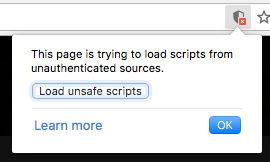

# restaurants-userscript
Wix Restaurants userscript for easy development

## Install

Chrome, Safari: Use [Tampermonkey](https://tampermonkey.net/)

Firefox: Use [Greasemonkey](https://addons.mozilla.org/en-US/firefox/addon/greasemonkey/)

IE:

* To install UserScripts, you'll need to download AdGuard from http://adguard.com/en/welcome.html
* Once installed, open it up (Start -> Adguard)
* Click "Settings" in the bottom left corner, then go to Extensions
* Click "Add extension..." in the bottom left of the pane
* Enter the UserScript's URL
* Now go to the page(s) it applies to and you'll see your script in action

Edge: I wasn't able to install it, but apparently Tampermonkey added [suuport for Edge](https://tampermonkey.net/?ext=dhdg&browser=edge).

---

## restaurants-orders

### https

To test a site served via https you have two options:

Option 1: Open the website while the userscript is running, inside the site's local-storage find an entry whose key is "__restaurants_userscript.host" and change the protocol in its value to "https"  (also don't forget to run the local dev server in https mode)

Option 2: Open the website then enable loading of unsafe scripts:

